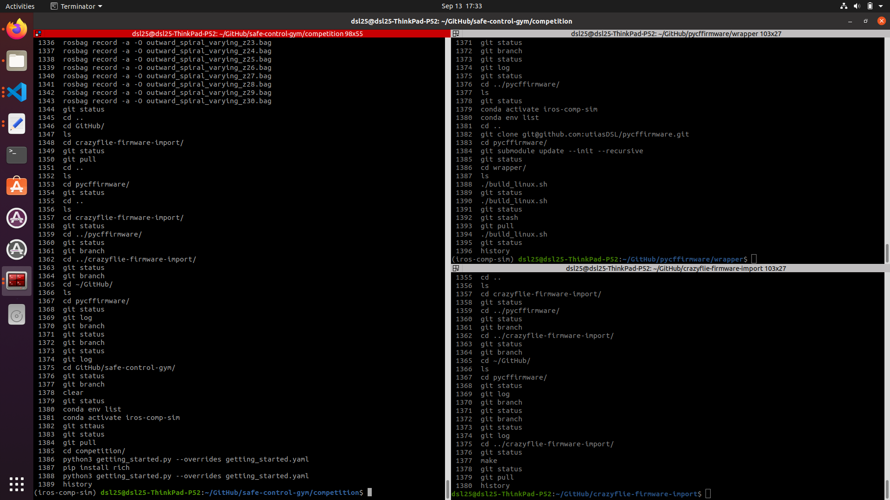
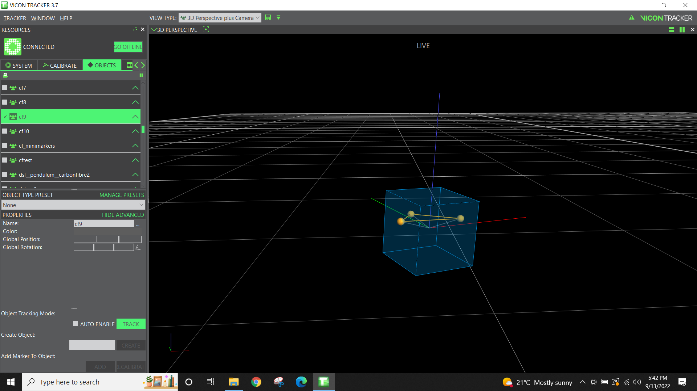
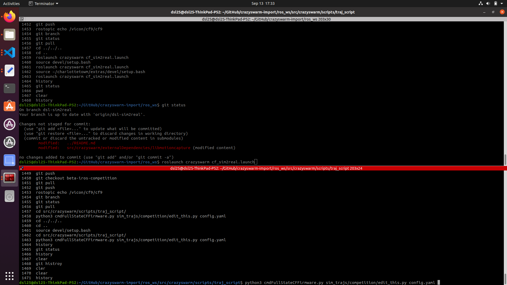

# Crazyswarm Groundstation for DSL's IROS 2022 "Safe Robot Learning" Competition

Simulation repositories:

- `safe-control-gym` branch: `beta-iros-competition`
- `pycffirmare` branch: `main`

Flight repositories:

- `crazyswarm-import` branch: `dsl-sim2real` (**this repo**)
- `crazyflie-firmware-import` branch `dsl-iros-comp-flight` (see also other `dsl-*` branches)

## Installation

```bash
# Install Ubuntu 20.04.4 LTS 64-bit on a Lenovo P52
# Run updates with "Ubuntu Software" (incl. firmware), "Software Updater", "Software & Updates"

# Update drivers
sudo ubuntu-drivers install

# (optional) Install vscode
sudo dpkg -i code_1.70.1-1660113095_amd64.deb

# Install/configure git
sudo apt install git
git config --global user.email "dsl_admin@robotics.utias.utoronto.ca" # change as necessary
git config --global user.name "utiasDSLadmin" # change as necessary

# Setup an SSH key
ssh-keygen 
cat ~/.ssh/id_rsa.pub # copy under https://github.com/settings/ssh/new for the corresponding account

# Install conda
bash Anaconda3-2022.05-Linux-x86_64.sh 
conda create -n iros-comp-sim python=3.8 # activate with 'conda activate iros-comp-sim' ONLY for the simulation terminals
conda create -n py37 python=3.7 # activate with 'conda activate py37', optional, e.g. for using cfclient

# Note: the following assumes use of Ubuntu 20's /usr/bin/python3 (Python 3.8)

# Install ROS
sudo sh -c 'echo "deb http://packages.ros.org/ros/ubuntu $(lsb_release -sc) main" > /etc/apt/sources.list.d/ros-latest.list'
sudo apt install curl
curl -s https://raw.githubusercontent.com/ros/rosdistro/master/ros.asc | sudo apt-key add -
sudo apt update
sudo apt install ros-noetic-desktop-full
echo "source /opt/ros/noetic/setup.bash" >> ~/.bashrc
source ~/.bashrc

# Create a folder for the required repositories
mkdir ~/GitHub

# Install crazyswarm-import
cd ~/GitHub
git clone -b dsl-sim2real git@github.com:utiasDSL/crazyswarm-import.git
cd crazyswarm-import
git submodule update --init --recursive
export CSW_PYTHON=python3
sudo apt install -y ros-noetic-tf ros-noetic-tf-conversions ros-noetic-joy
sudo apt install -y libpcl-dev libusb-1.0-0-dev
sudo apt install -y swig lib${CSW_PYTHON}-dev ${CSW_PYTHON}-pip
${CSW_PYTHON} -m pip install pytest numpy PyYAML scipy
${CSW_PYTHON} -m pip install matplotlib empy rospkg
# Custom DSL fix: replace line 102 in `vicon.cpp` to not throw an error when a rigid body is lost
cp -f ./dslpatch_vicon.cpp ./ros_ws/src/crazyswarm/externalDependencies/libmotioncapture/src/vicon.cpp
./build.sh
source ros_ws/devel/setup.bash

# Install Vicon bridge nodelet
mkdir -p ~/GitHub/vicon_ws/src
cd ~/GitHub/vicon_ws/src/
git clone -b vicon-bridge-nodelet git@github.com:utiasDSL/extras.git
cd ..
source ~/GitHub/crazyswarm-import/ros_ws/devel/setup.bash # Important, source crazyswarm before making the new node
catkin_make
source ~/GitHub/vicon_ws/devel/setup.bash

# Install and make crazyflie-firmware-import
cd ~/GitHub
git clone -b dsl-iros-comp-flight git@github.com:utiasDSL/crazyflie-firmware-import.git # other options are `dsl-sim2real-logging-v1`, etc.
cd crazyflie-firmware-import
git submodule update --init --recursive
sudo apt-get install make gcc-arm-none-eabi
make cf2_defconfig # Make the default config file.
make -j 12

# USB preparation for crazyradio
sudo groupadd plugdev
sudo usermod -a -G plugdev $USER
```

> Copy-paste the following block in a terminal

```bash
cat <<EOF | sudo tee /etc/udev/rules.d/99-bitcraze.rules > /dev/null
# Crazyradio (normal operation)
SUBSYSTEM=="usb", ATTRS{idVendor}=="1915", ATTRS{idProduct}=="7777", MODE="0664", GROUP="plugdev"
# Bootloader
SUBSYSTEM=="usb", ATTRS{idVendor}=="1915", ATTRS{idProduct}=="0101", MODE="0664", GROUP="plugdev"
# Crazyflie (over USB)
SUBSYSTEM=="usb", ATTRS{idVendor}=="0483", ATTRS{idProduct}=="5740", MODE="0664", GROUP="plugdev"
EOF
```

```bash
# Apply changes
sudo udevadm control --reload-rules
sudo udevadm trigger

# Flash crazyflie C10 (cf9 in the Vicon objects list)
# Turn the Crazyflie off, then start the Crazyflie in bootloader mode by pressing the power button for 3 seconds. Both the blue LEDs will blink.
cd ~/GitHub/crazyflie-firmware-import/
make cload

# Note: the following assumes you created conda's Python 3.7 environment `py37`

# (optional) Install cfclient
sudo apt install libxcb-xinerama0
conda activate py37
pip3 install --upgrade pip # note: we are using a conda python3.7 env
pip3 install cfclient
conda deactivate

# Note: the following requires you created conda's Python 3.8 environment `iros-comp-sim`

# Install safe-control-gym's competition branch and pycffirmware
cd ~/GitHub
git clone -b beta-iros-competition git@github.com:utiasDSL/safe-control-gym.git
cd safe-control-gym
conda activate iros-comp-sim
pip install --upgrade pip
pip install -e .
cd ~/GitHub
git clone git@github.com:utiasDSL/pycffirmware.git
cd pycffirmware/
git submodule update --init --recursive
# On Ubuntu (see below for macOS)
sudo apt update
sudo apt -y install swig
sudo apt install build-essential
cd wrapper/
chmod +x build_linux.sh
conda activate safe
./build_linux.sh
# Alternatively, on macOS
brew install swig
brew install gcc            # Also run `xcode-select --install` if prompted
brew install make
cd wrapper/
chmod +x build_osx.sh       # Assumes `gcc` is at `/usr/local/bin/gcc-12`
conda activate safe
./build_osx.sh
```

## Vicon and ground station setups

1) Crazyflie, crazyradio, Vicon switch and cameras hub


2) Simulation and firmware flashing terminals


3) Vicon screen


4) Crazyswarm and flight controller solution terminals


## Run a sim2real Experiment

Make sure you are familiar with the configuration files (not all options are actually relevant depending on the motion capture setup, read the [official documentation](https://crazyswarm.readthedocs.io/en/latest/configuration.html#adjust-configuration-files):

- [Crazyflies types](https://github.com/utiasDSL/crazyswarm-import/blob/dsl-sim2real/ros_ws/src/crazyswarm/launch/crazyflieTypes.yaml)—includes controller properties and marker configurations, etc.
- [In-use Crazyflies](https://github.com/utiasDSL/crazyswarm-import/blob/dsl-sim2real/ros_ws/src/crazyswarm/launch/crazyflies.yaml)—includes ID, radio channel, types, etc.
- [All Crazyflies](https://github.com/utiasDSL/crazyswarm-import/blob/dsl-sim2real/ros_ws/src/crazyswarm/launch/allCrazyflies.yaml)

As well as the launch file and Python script:

- [`cf_sim2real.launch`](https://github.com/utiasDSL/crazyswarm-import/blob/dsl-sim2real/ros_ws/src/crazyswarm/launch/cf_sim2real.launch)
- [`cmdFullStateCFFirmware.py`](https://github.com/utiasDSL/crazyswarm-import/blob/dsl-sim2real/ros_ws/src/crazyswarm/scripts/traj_script/cmdFullStateCFFirmware.py)

## Fly

Note: the following is NOT within a xonda environment

In one terminal:

```bash
source ~/GitHub/crazyswarm-import/ros_ws/devel/setup.bash # source crazyswarm
source ~/GitHub/vicon_ws/devel/setup.bash # source vicon bridge nodelet
cd ~/GitHub/crazyswarm-import/ros_ws
roslaunch crazyswarm cf_sim2real.launch
```

In a second terminal:

```bash
source ~/GitHub/crazyswarm-import/ros_ws/devel/setup.bash # source crazyswarm
cd ~/GitHub/crazyswarm-import/ros_ws/src/crazyswarm/scripts/traj_script/
python3 cmdFullStateCFFirmware.py sim_trajs/competition/edit_this.py config.yaml --overrides ~/GitHub/safe-control-gym/competition/level3.yaml
```

where `edit_this.py` is copied from `safe-control-gym`'s IROS competition branch


## Competition Evaluations

Install `safe-control-gym:beta-iros-competiton` for system's Python (used by Crazyswarm)


```bash
cd ~/GitHub/safe-control-gym
pip install --upgrade pip
pip install .
# pip install -Iv PyYAML==5.3 # If necessary, revert to cfclient's YAML version instead of the newer one installed by safe-control-gym
```

```bash

# 1st place (note: edit lines 368-369 in cmdFullStateCFFirmware.py)
python3 cmdFullStateCFFirmware.py ~/GitHub/solutions/h2/sim2real_evaluation/edit_this.py config.yaml --overrides ~/GitHub/safe-control-gym/competition/level3.yaml # Team h2, 1.68s start up 12.0s flight time 

# 2n place
python3 cmdFullStateCFFirmware.py ~/GitHub/solutions/eku/sim2real_evaluation/edit_this.py config.yaml --overrides ~/GitHub/safe-control-gym/competition/level3.yaml # Team eku 3.49 start up 22.51 flight time

# 3rd place
python3 cmdFullStateCFFirmware.py ~/GitHub/solutions/arg/sim2real_evaluation/edit_this.py config.yaml --overrides ~/GitHub/safe-control-gym/competition/level3.yaml # Team arg, 25.9s start up 16.48s flight 

# 4th place
python3 cmdFullStateCFFirmware.py ~/GitHub/solutions/zq/sim2real_evaluation/edit_this.py config.yaml --overrides ~/GitHub/safe-control-gym/competition/level3.yaml # Team zq, collision on 2nd gate
```

## TODOs

- n/a
